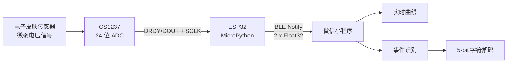

# BLE E-Skin Sensor

基于 **ESP32 + CS1237 + 微信小程序** 的电子皮肤微弱电压采集与 BLE 可视化系统。

ESP32 端使用 MicroPython 读取 CS1237 的 24 位 ADC 数据，完成启动零点校准和电压换算，并通过 Bluetooth Low Energy（BLE）发送电压与时间戳。微信小程序负责发现附近设备、建立连接、实时绘制电压曲线，以及根据电压变化识别二进制事件并转换为字符。

> [!IMPORTANT]
> 电子皮肤传感元件可以输出无需外加测量偏置的电压信号，但 CS1237、ESP32 和 BLE 通信电路仍需外部供电。本项目不应被描述为整机“无电池”或“完全自供能”系统。

## 功能概览

- 读取 CS1237 的 24 位二进制补码 ADC 数据
- 启动时进行 30 次采样的零点偏置校准
- 将原始 ADC 值换算为微伏（μV）
- ESP32 端三点中位数滤波及缓冲区定期裁剪
- 通过 BLE Notify 发送电压值与运行时间
- 微信小程序扫描并显示附近的 BLE 设备、RSSI 和服务数量
- 实时显示电压曲线、当前电压和时间
- 小程序端进行中位数滤波、异常值抑制和动态事件检测
- 将上升/下降事件编码为 `1`/`0`，每 5 bit 转换为字母

## 系统结构



## 仓库结构

```text
BLE-e-skin-sensor/
├── main.py                              # ESP32 MicroPython 固件
├── Ble e-skin Sensor_MiniProgram/       # 微信小程序源码
│   ├── app.js
│   ├── app.json
│   ├── app.wxss
│   ├── project.config.json
│   ├── index/                           # BLE 扫描和设备列表页
│   │   ├── index.js
│   │   ├── index.json
│   │   ├── index.wxml
│   │   └── index.wxss
│   └── deviceDetail/                    # 连接、曲线和事件解码页
│       ├── deviceDetail.js
│       ├── deviceDetail.json
│       ├── deviceDetail.wxml
│       └── deviceDetail.wxss
└── README.md
```

## 硬件需求

| 组件 | 用途 | 说明 |
| --- | --- | --- |
| 支持 BLE 的 ESP32 开发板 | 采集、处理和无线发送 | 需运行包含 `bluetooth`、`machine` 模块的 MicroPython 固件 |
| CS1237 ADC/模块 | 微弱差分电压采集 | 24 位 ADC；代码配置为通道 1、PGA 128、10 Hz |
| 电子皮肤传感器 | 信号源 | 接入 CS1237 的差分模拟输入；具体极性和端子以实际硬件为准 |
| 手机 | 数据显示 | 需支持 BLE 并可运行微信小程序 |
| 稳定电源 | 为采集和通信电路供电 | 电压、电流能力和接地方式需按所用开发板及 ADC 模块确认 |

### 固件中的数字引脚

| CS1237 信号 | ESP32 GPIO | `main.py` 常量 |
| --- | ---: | --- |
| DRDY/DOUT | 48 | `DRDY_PIN` |
| SCLK | 45 | `SCLK_PIN` |

仓库目前未提供完整原理图，也未指定开发板、CS1237 模块版本及电源端子。接线前请核对所用硬件的数据手册，确认电源电压、逻辑电平、差分输入范围和共地方式。若所用 ESP32 板卡未引出 GPIO 45/48，请在 `main.py` 中修改相应常量。

## 软件环境

- ESP32 端：MicroPython
- 固件上传工具：Thonny、`mpremote` 或其他 MicroPython 文件管理工具
- 客户端：微信开发者工具
- 微信基础库：仓库的 `project.config.json` 当前记录为 `3.16.0`

> 微信 BLE API 和权限要求可能随微信基础库、手机系统及微信版本变化。建议使用真机调试；开发者工具模拟器通常不能完整替代真实 BLE 连接。

## 快速开始

### 1. 克隆仓库

```bash
git clone https://github.com/bin226/BLE-e-skin-sensor.git
cd BLE-e-skin-sensor
```

### 2. 连接硬件

1. 将 CS1237 的 `DRDY/DOUT` 接到 ESP32 GPIO 48。
2. 将 CS1237 的 `SCLK` 接到 ESP32 GPIO 45。
3. 将电子皮肤传感器接到 CS1237 的差分模拟输入。
4. 按实际模块要求连接电源和地，并确保 ESP32 与 CS1237 逻辑电平兼容。

由于仓库未附电路图，以上仅覆盖源码能够确认的两根数字信号线。模拟输入、电源和参考电压连接必须以实际 CS1237 模块资料为准。

### 3. 部署 MicroPython 固件

1. 为 ESP32 刷入与开发板兼容、支持 BLE 的 MicroPython 固件。
2. 通过 Thonny、`mpremote` 等工具连接开发板。
3. 将仓库根目录的 `main.py` 上传到开发板文件系统根目录，并保持文件名为 `main.py`。
4. 重启开发板，或在 MicroPython REPL 中执行该文件。
5. 保持传感器输入稳定，等待启动零点校准完成。

启动后串口应依次看到类似输出：

```text
Calibrating zero offset...
Calibration reading 1/30
...
Calibration complete. Offset: <raw_offset>
Starting main loop and BLE advertising...
Time: 0.2s, Raw Voltage: <value>μV, Filtered Voltage: <value>μV
```

设备随后以 `ESP32-CS1237-Sensor` 为名称进行 BLE 广播。

### 4. 导入微信小程序

1. 打开微信开发者工具。
2. 选择“导入项目”。
3. 将项目目录指向 `Ble e-skin Sensor_MiniProgram`。
4. 使用自己的小程序 AppID；仓库中的 `project.config.json` 仅包含占位值 `******`。
5. 编译项目，并使用支持 BLE 的手机进行真机调试。
6. 根据手机系统提示开启蓝牙，并授予微信/小程序所需的蓝牙或附近设备权限。

### 5. 采集与查看数据

1. 给 ESP32 和 CS1237 上电，等待零点校准完成。
2. 小程序首页会自动打开蓝牙适配器并扫描附近设备。
3. 在列表中选择 `ESP32-CS1237-Sensor`。
4. 小程序连接设备、查找服务 `0x181A`，并为带有 Notify 属性的特征启用通知。
5. 设备详情页显示实时电压曲线、当前电压、二进制事件历史和字符输出。

## BLE 通信协议

### 广播与 GATT

| 项目 | 值 | 说明 |
| --- | --- | --- |
| 广播名称 | `ESP32-CS1237-Sensor` | 小程序列表中的目标设备名 |
| 广播间隔参数 | `100000` μs | 由 `gap_advertise()` 设置，约 100 ms |
| Service UUID | `0x181A` | 小程序按完整 UUID `0000181A-0000-1000-8000-00805F9B34FB` 查找 |
| Characteristic UUID | `0x2A58` | 属性为 Read、Notify、Write |
| 数据字节序 | Little-endian | ESP32 使用 `struct.pack('<ff', ...)` |
| 通知载荷 | 8 bytes | 两个连续的 IEEE 754 Float32 |

> `0x181A` 和 `0x2A58` 属于 16 位 Bluetooth UUID 空间。当前项目将它们用于自己的数据结构；若准备发布产品或与通用 BLE 客户端互操作，建议改用正式申请或随机生成的 128 位自定义 UUID，并同步修改固件和小程序。

### Notify 数据格式

| 偏移 | 长度 | 类型 | 字节序 | 含义 | 单位 |
| ---: | ---: | --- | --- | --- | --- |
| 0 | 4 bytes | Float32 | Little-endian | 零点校准后的原始电压 | μV |
| 4 | 4 bytes | Float32 | Little-endian | ESP32 启动后的运行时间 | s |

JavaScript 解析方式：

```javascript
const view = new DataView(buffer);
const voltage = view.getFloat32(0, true);
const timestamp = view.getFloat32(4, true);
```

Python 解析方式：

```python
from struct import unpack

voltage_uv, timestamp_s = unpack("<ff", payload)
```

### 写入命令

| 写入内容 | 动作 |
| --- | --- |
| 单字节 `0xFF` | 调用 MicroPython `machine.reset()` 重启 ESP32 |

当前微信小程序仅订阅通知，没有提供发送 `0xFF` 的界面。该命令可供其他 BLE 客户端使用；执行前应保存必要数据，因为设备会立即重启并重新校准。

## 数据处理

### ESP32 端

1. 向 CS1237 写入配置字节 `0x1C`。
2. 读取 24 位二进制补码数据。
3. 对 30 个读数求平均，作为启动零点偏置。
4. 按下式换算为微伏：

   ```text
   voltage_μV = raw × VREF / (2^23 × PGA_GAIN) × 10^6
   ```

   当前代码取 `VREF = 3.3 V`、`PGA_GAIN = 128`。

5. 固件在每次循环末尾等待 200 ms；CS1237 配置注释标明其转换速率为 10 Hz。由于读取过程还会等待 DRDY，实际通知频率会受 ADC 就绪时间和代码执行时间影响，可能低于 5 Hz。
6. 串口显示三点中位数滤波值，但 BLE 通知发送的是未经过该三点中位数滤波的零点校准电压。

> `VREF = 3.3 V` 是源码中的计算参数，不代表所有 CS1237 模块的实际参考电压。若硬件参考电压不同，必须修改该值并进行已知输入标定。

### 小程序端

小程序接收 BLE 电压后进行另一组处理：

- 五点中位数滤波；
- 以最近 10 s 数据均值为参考，抑制超过 ±1000 μV 的异常跳变；
- 使用约 3.6 s 的滑动窗口估算基线；
- 上升事件阈值为 140 μV，下降事件阈值为 50 μV；
- 最小事件持续时间为 0.6 s，最小变化率为 20 μV/s；
- 检测到的上升/下降事件分别形成二进制输出；
- 每 5 bit 按固定映射转换为 `A–Z`，`11111` 映射为空格。

这些阈值来自当前源码，不是对所有电子皮肤器件都通用的标定结果。更换传感器、机械结构、接触方式、环境温度或模拟前端后，应重新采集数据并调整参数。

## 主要配置项

### `main.py`

| 常量 | 默认值 | 作用 |
| --- | ---: | --- |
| `DRDY_PIN` | `48` | CS1237 DRDY/DOUT 引脚 |
| `SCLK_PIN` | `45` | CS1237 时钟引脚 |
| `VREF` | `3.3` | ADC 电压换算所用参考值 |
| `PGA_GAIN` | `128` | ADC 增益 |
| `MEDIAN_FILTER_WINDOW_SIZE` | `3` | 串口显示用中位数窗口 |
| `DELETION_INTERVAL_S` | `180` | 电压缓冲区裁剪间隔 |
| `START_DELETION_AFTER_S` | `360` | 开始裁剪缓冲区前的运行时间 |

### `deviceDetail/deviceDetail.js`

| 常量 | 默认值 | 作用 |
| --- | ---: | --- |
| `MAX_DATA_POINTS` | `250` | 曲线最多保留的数据点数 |
| `WINDOW_SECONDS` | `3.6` | 事件检测滑动窗口 |
| `SAMPLING_INTERVAL_S` | `0.2` | 客户端假设的采样间隔 |
| `THRESHOLD_RISE` | `140.0` μV | 上升事件阈值 |
| `THRESHOLD_FALL` | `50.0` μV | 下降事件阈值 |
| `MIN_DURATION_S` | `0.6` s | 最小事件持续时间 |
| `MIN_DV_DT` | `20.0` μV/s | 最小电压变化率 |
| `SETTLE_TIME_S` | `1.25` s | 事件后稳定等待时间 |
| `SUPPRESS_TIMEOUT_S` | `6.0` s | 抑制状态超时 |
| `VOLTAGE_CHANGE_THRESHOLD_UV` | `1000` μV | 相对参考均值的异常变化阈值 |

## 常见问题

### 小程序找不到设备

- 确认 ESP32 已通过启动校准并开始广播。
- 确认手机蓝牙已开启，微信拥有所需权限。
- 使用真机而不是仅依赖开发者工具模拟器。
- 靠近设备，并确认列表中是否出现其他名称正常的 BLE 设备。
- 查看 ESP32 串口是否持续输出采样值或 DRDY 超时错误。

### 提示找不到服务 `0x181A`

- 确认运行的是本仓库的 `main.py`。
- 删除手机中可能缓存的旧连接，重启蓝牙和 ESP32 后重试。
- 若修改了固件 UUID，必须同步修改小程序 `deviceDetail.js` 中的完整 Service UUID。

### 一直出现 `Timeout waiting for DRDY low`

- 核对 DRDY/DOUT 是否接到 GPIO 48。
- 核对 CS1237 是否正确供电并与 ESP32 共地。
- 检查逻辑电平和模块引脚定义。
- 若硬件使用其他 GPIO，修改 `DRDY_PIN`。

### 电压值比例不正确或漂移明显

- 核对实际参考电压是否与 `VREF = 3.3` 一致。
- 在稳定、无外界刺激的条件下重新启动并完成零点校准。
- 检查传感器极性、接触电阻、电源噪声和屏蔽。
- 使用已知微弱电压源标定 ADC；不要仅凭代码公式替代硬件标定。

### 曲线正常，但二进制识别不稳定

- 当前阈值为项目源码中的经验参数，需针对实际传感器重新标定。
- 检查采样间隔是否仍约为 0.2 s。
- 记录静态基线、正向事件和负向事件数据，再调整阈值、持续时间和变化率条件。

## 已知限制

- 仓库尚未提供电路原理图、PCB、物料清单、机械结构或传感器制备说明。
- 尚未声明经验证的 ESP32 开发板型号和 MicroPython 版本。
- 当前零点校准假设启动后的输入在约 6 s 内保持稳定。
- DRDY 等待超时会返回 `0`，可能被后续流程当作有效数据处理。
- BLE 发送的是固件端未中位数滤波的电压；串口打印值与 BLE 客户端接收值的处理路径不同。
- 小程序连接后会为所有支持 Notify 的特征启用通知，而非只匹配 `0x2A58`。
- 小程序尚无主动断开、重新连接、参数配置、数据导出和远程重启界面。
- 事件识别阈值尚未随硬件、温度、用户或器件自动标定。

## 安全与使用说明

本项目为实验和研究用途。若电子皮肤与人体或机器人系统连接，请根据实际应用补充电气隔离、过流/过压保护、绝缘、温升限制和失效保护。不要将未经验证的实验原型用于医疗诊断、治疗或安全关键控制。

## 贡献

欢迎通过 Issue 报告问题，或提交 Pull Request 改进固件、小程序、硬件文档和数据处理流程。提交前请说明：

- 使用的 ESP32 开发板和 MicroPython 版本；
- CS1237 模块及接线方式；
- 能够复现问题的步骤和串口日志；
- 若修改 BLE 协议，请同时更新固件、小程序和本文档。

## 许可证

仓库目前未包含 `LICENSE` 文件。使用、复制或分发代码前，请先向仓库作者确认许可条件；如项目计划开源，建议补充明确的开源许可证。
